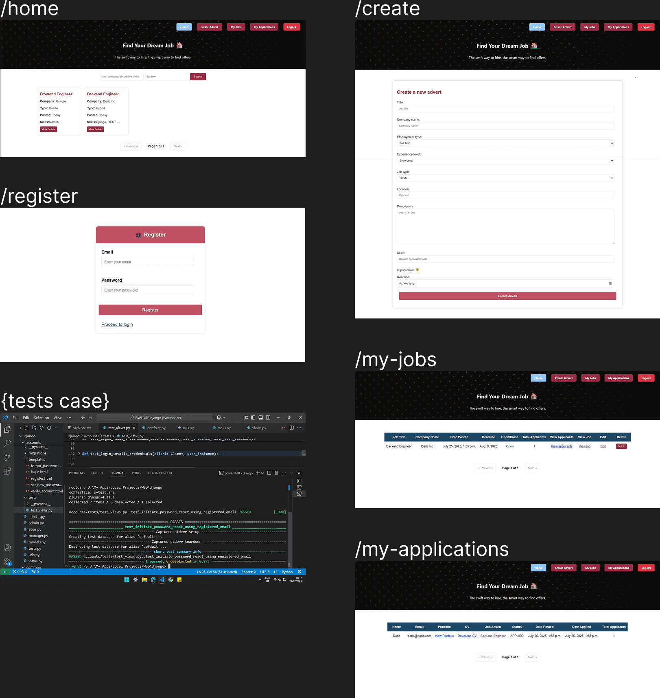

# Django Job Portal

## Overview

**Django Job Portal** is a web-based platform designed to streamline job posting and application processes. It allows users to create, update, and delete job postings as well as apply for available job opportunities. The application supports both job seekers and job posters, offering a centralized place to share vacancies, review applicants’ CVs, and manage job listings effectively.

## Features

### ✅ Current Features:
- Create, read, update, and delete (CRUD) job posts
- Apply to available jobs
- View applicants’ CVs (Curriculum Vitae)
- Search for relevant jobs based on keywords and location
- User authentication with login and registration
- Email verification upon registration
- Reset password functionality for forgotten passwords

### 🚀 Upcoming Features:
- Role-based authorization (user and admin)
- Intelligent job analysis and recommendations based on user CV

## Installation

To get started with the **Django Job Portal Web**, follow these steps:

1. **Clone the repository:**

    ```bash
    git clone https://github.com/muhammadderic/django-job-portal.git
    cd django-job-portal
    ```

2. **Install dependencies:**

    ```bash
    pip install -r requirements.txt
    ```

3. **Run the development server:**

    ```bash
    python manage.py runserver
    ```

    Visit [http://localhost:8000](http://localhost:8000) to see the application in action.

## Screenshots

<div style="display: flex; justify-content: space-between;">
    
</div>

## Technologies Used

- **Django** – Web framework for building robust and scalable backend systems
- **SQLite** – Lightweight relational database used for local development
- **Pytest** – Framework for writing and running unit tests

## Contributing

Contributions are welcome! If you'd like to contribute to this project, please follow these steps:

1. Fork the repository.
2. Create a new branch for your feature or bugfix.
3. Commit your changes and push your branch.
4. Open a pull request to have your changes reviewed.

## License

This project is licensed under the MIT License. See the [LICENSE](LICENSE) file for more details.

## Contact

If you have any questions or suggestions, feel free to reach out:

- **GitHub**: [muhammadderic](https://github.com/muhammadderic)

## Additional Info

For developers: You can test various functionalities implemented in individual apps, such as `accounts` and `application_tracking`, to explore how authentication, job management, and applications are handled.
